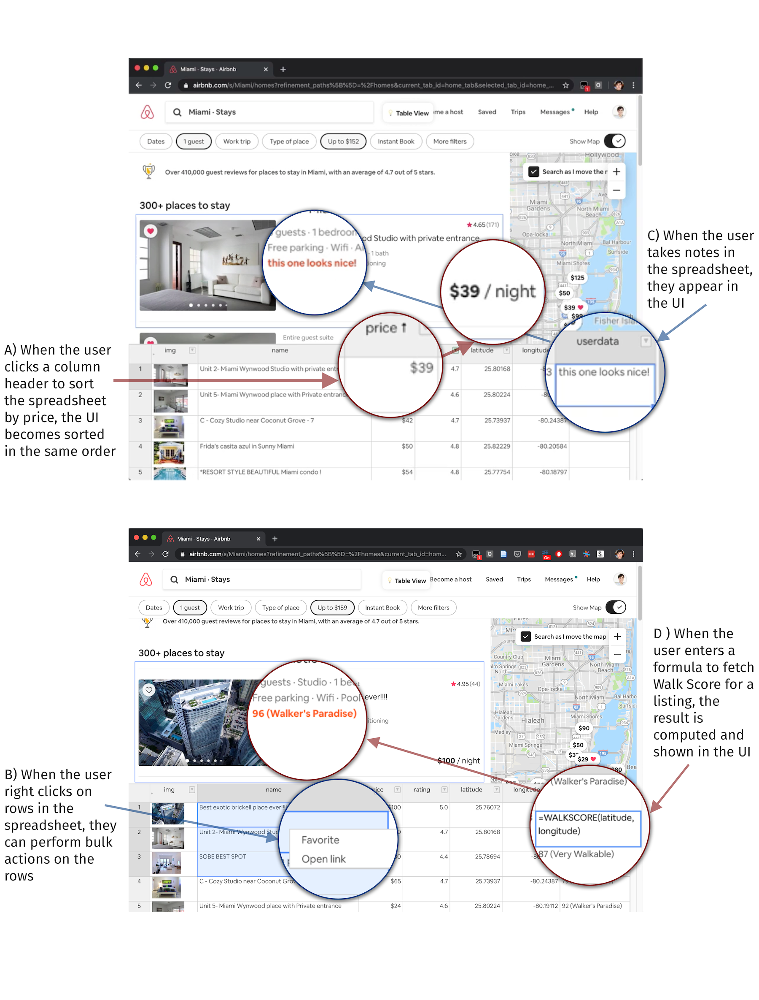
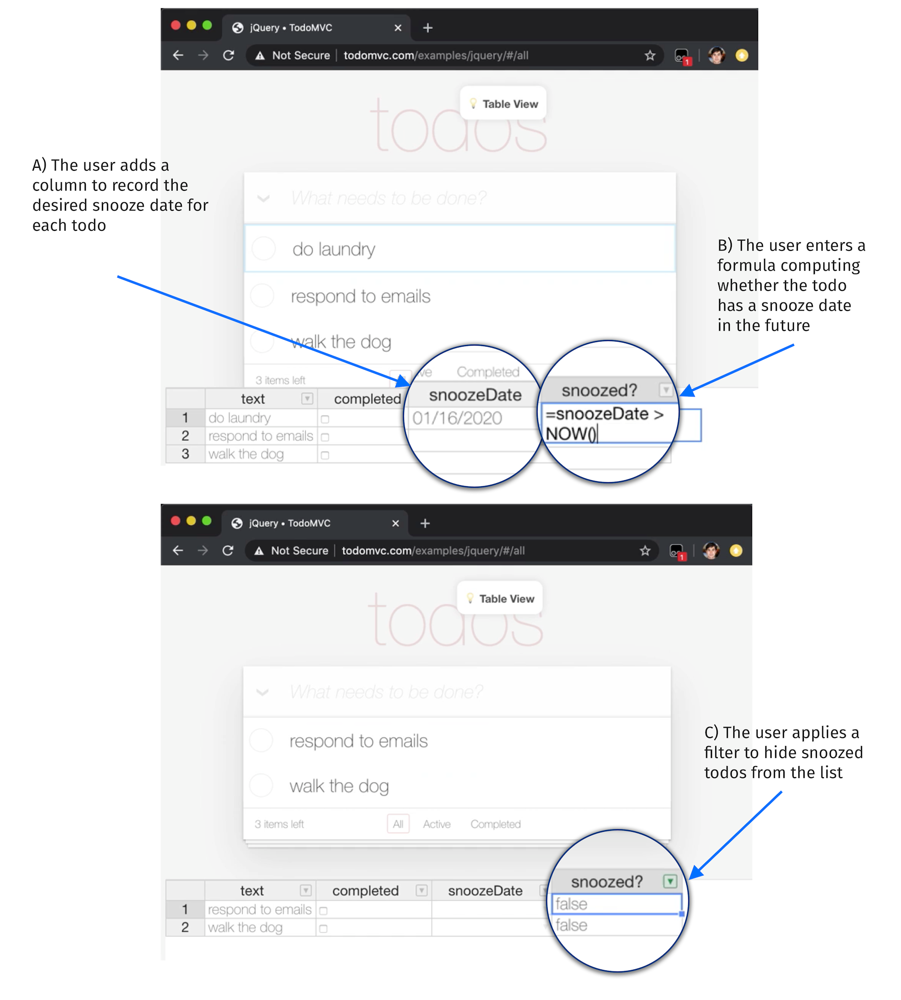
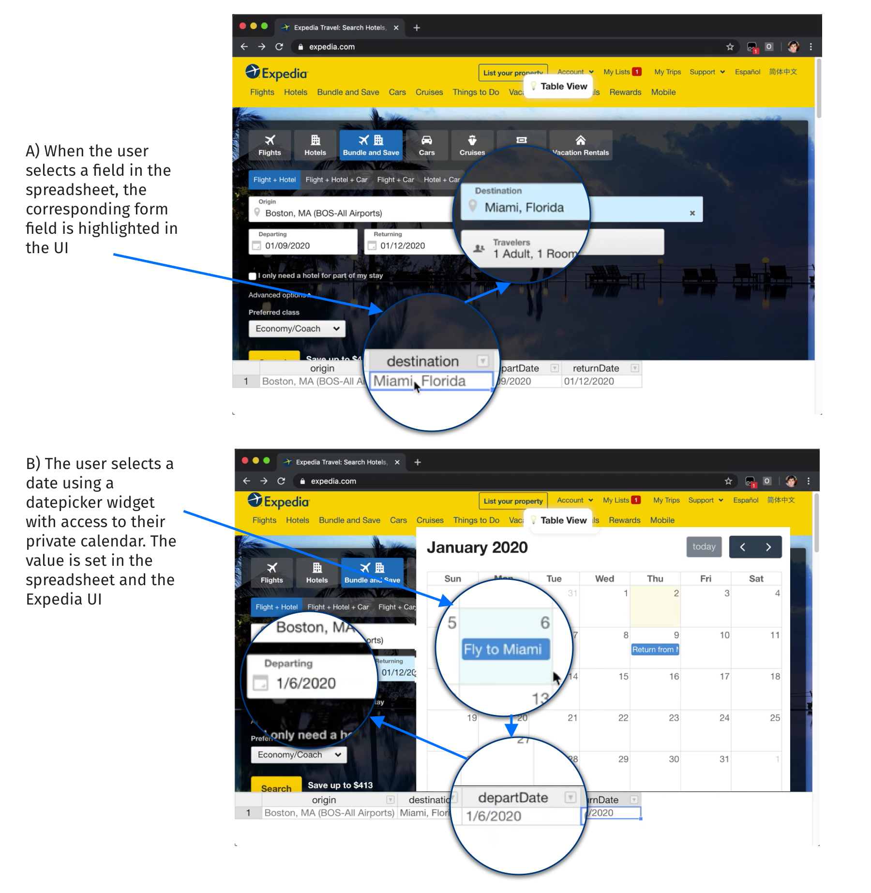
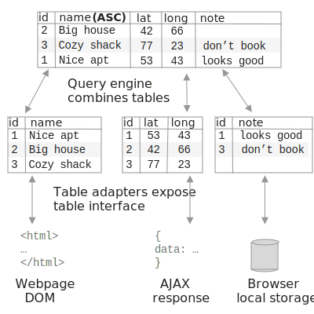

# Introduction

Most attempts at empowering end users to customize their software offer a simplified version of programming. Some scripting languages (AppleScript, Chickenfoot) have a friendly syntax that resembles natural language. Visual programming tools (Mac Automator, Zapier) eliminate text syntax entirely. Macro recorders (Applescript, Helena, WebVCR) remove some of the initial programming burden by letting a user start with concrete demonstrations.

Despite  their many differences, these approaches all share something in common: an imperative programming model, with statement sequencing, mutable variables and loops. End users express their ideas in scripts—sequences of commands—which, name aside, are not very different from conventional code.

We have known for decades about an alternate approach: _direct manipulation_ [@shneiderman1983], where "visibility of the object of interest" replaces "complex command language syntax". Direct manipulation is the _de facto_ standard in GUIs today, but when it comes to customizing software, it is rarely to be found. In this work, we ask: what would it look like to build a software customization interface that  relies on direct manipulation? We take inspiration from spreadsheets and visual database query interfaces [@2020a; @bakke2016], which have successfully enabled end users to run queries and computations through direct manipulation of data.

In this paper we present a technique called _table-driven customization_, which applies ideas from visual query interfaces in the context of software customization. An application’s UI is augmented with a table view, where the user can see and manipulate the application’s internal data . Changes in the table view result in immediate corresponding changes to the original user interface of the application, enabling the user to customize an application with live feedback.

We have developed a browser extension called Wildcard which uses web scraping techniques to implement table-driven customization for existing Web applications. In [@sec:examples], we introduce the key ideas of table-driven customization by presenting several examples of real customizations implemented in Wildcard.

In [@sec:architecture], we explain the architecture of table-driven customization. We focus on the _table adapter_ abstraction, which allows many different types of underlying data to be bidirectionally mapped to a table. We describe several types of table adapters we’ve built in Wildcard, and also describe future adapters that are supported by the general paradigm.

We have used Wildcard to build real customizations for 11 different websites. In [@sec:evaluation], we present reflections from this process, outlining the kinds of customizations we were able to build, limitations we encountered, and reflections on the ease of integrating scraping logic with real websites.

In [@sec:themes], we discuss some key themes from our work:

* *Customization by direct manipulation*: End users should be able to customize an application by directly examining and modifying its data, rather than by writing imperative scripts.
* *Third-party semantic wrappers*: Typically, tools that don't rely on official extension APIs resort to offering low-level APIs for customization. Instead, we propose a community-maintained library of semantic wrappers around existing applications, enabling end users to work with domain objects rather than low-level representations.

Table-driven customization relates to existing work in many areas. In particular, our goals overlap with many software customization tools, and our methods overlap with direct manipulation interfaces for working with structured data, including visual database query systems and spreadsheets. We explore these connections and more in [@sec:related-work].

# Examples {#sec:examples}

_todo: maybe redo this as a separate example to avoid self plagiarism?_

To concretely illustrate the end user experience of table-driven customization, here are several real examples of using the Wildcard browser extension to customize websites.

<div class="html-only">
{#fig:airbnb-demo}
</div>
<div class="pdf-only">
```{=latex}
\begin{figure*}
\hypertarget{fig:airbnb-demo}{%
\centering
\includegraphics{media/airbnb-demo-300dpi.png}
\caption{Using Wildcard to augment the Airbnb search page for booking
accommodations}\label{fig:airbnb-demo}
}
\end{figure*}
```
</div>

## Augmenting search results

In 2012, the travel site Airbnb removed the ability to sort accommodation searches by price. Users could still filter by price range, but could no longer view the cheapest listings first. Many users complained that the change seemed hostile to users. "It's so frustrating! What is the logic behind not having this function?" said one user on the [Airbnb support forum](https://community.withairbnb.com/t5/Hosting/Sorting-listing-by-price/td-p/559404). Alas, the feature remains missing to this day.

Using Wildcard, the user can fix this omission, while leaving the page's design and the rest of its functionality unchanged.<span class="pdf-only"> [@fig:airbnb-demo] shows an overview of augmenting the Airbnb site.</span> First, the user opens up the Wildcard panel, which shows a table corresponding to the search results in the page. As they click around in the table, the corresponding row in the page is highlighted to indicate the mapping between the views.

Then, the user clicks on the price column header to sort the spreadsheet and the Airbnb UI by price<span class="pdf-only"> ([@fig:airbnb-demo], Note A)</span>. They also filter to listings with a user rating above 4.5 (another feature missing in the original Airbnb UI).

After manipulating the data, the user closes the table view and continues using the website. Because the application's UI usually has a nicer visual design than a spreadsheet, Wildcard does not aim to replace it—at any time, the user can use either the UI, the spreadsheet, or both together.

Many websites that show lists of data also offer actions on rows in the table, like adding an item to a shopping cart. Wildcard has the ability to make these "row actions" available in the data table through the site adapter. In the Airbnb UI, saving multiple listings to a Favorites list requires tediously clicking through them one by one. Using Wildcard row actions, the user can select multiple rows and favorite all of them with a single click<span class="pdf-only"> ([@fig:airbnb-demo], Note B)</span>. Similarly, the user can open the detailed pages for many listings at once.

Next, the user wants to jot down some notes about each listing. To do this, they type some notes into an additional column in each row, and the notes appear inside the listings in the original UI<span class="pdf-only"> ([@fig:airbnb-demo], Note C)</span>. The annotations are saved in the browser and associated with the backend ID of the listing, so they will appear in future browser sessions that display the same listing.

Wildcard also includes a formula language that enables more sophisticated customizations. When traveling without a car, it's useful to evaluate potential places to stay based on how walkable the surroundings are. Using a formula, the user can integrate Airbnb with Walkscore, an API that rates the walkability of any location on a 1-100 scale. When the user calls the `walkscore` formula with the listing's latitude and longitude as arguments, it returns the walk score for that location and shows it as the cell value. Because the cell's contents are injected into the page, the score also appears in the UI<span class="pdf-only"> ([@fig:airbnb-demo], Note D)</span>.

## Snoozing todos

<div class="html-only">
{#fig:todomvc-demo}
</div>
<div class="pdf-only">
```{=latex}
\begin{figure*}
\hypertarget{fig:airbnb-demo}{%
\centering
\includegraphics{media/todomvc-demo-300dpi.png}
\caption{Using Wildcard to add a "snooze" feature to the TodoMVC todo list app}\label{fig:todomvc-demo}
}
\end{figure*}
```
</div>

In addition to fetching data from other sources, Wildcard formulas can also perform computations. In this example, the user would like to augment the TodoMVC todo list app with a "snooze" feature, which will temporarily hide a todo from the list until a certain date.<span class="pdf-only"> [@fig:todomvc-demo] shows an overview of this customization.</span>

The user opens the table view, which shows the text and completed status of each todo. They start the customization by adding a new column to store the snooze date for each todo<span class="pdf-only"> ([@fig:todomvc-demo], Note A)</span>.

The next step is to hide snoozed todos. The user creates a `snoozed?` column, which uses a formula to compute whether a todo is snoozed—i.e., whether it has a snooze date in the future<span class="pdf-only"> ([@fig:todomvc-demo], Note B)</span>. Then, they simply filter the table to hide the snoozed todos<span class="pdf-only"> ([@fig:todomvc-demo], Note C)</span>.

Because the built-in `NOW()` function always returns the current datetime, snoozed todos will automatically appear once their snooze date arrives.

Because this implementation of snoozing was built on the spreadsheet abstraction, it is completely decoupled from this particular todo list app. We envision that users could share these types of customizations as generic browser extensions, which could be applied to any site supported by Wildcard with no additional effort.

## Adding a custom datepicker

<div class="html-only">
{#fig:expedia-demo}
</div>
<div class="pdf-only">
```{=latex}
\begin{figure*}
\hypertarget{fig:airbnb-demo}{%
\centering
\includegraphics{media/expedia-demo-300dpi.png}
\caption{Using Wildcard to augment the Expedia page for booking a flight}\label{fig:expedia-demo}
}
\end{figure*}
```
</div>

It might seem that Wildcard is only useful on websites that display lists of tabular data, but the table metaphor is flexible enough to represent many types of data. For example, a flight search form on Expedia can be represented as a single row, with a column corresponding to each input<span class="pdf-only"> ([@fig:expedia-demo], Note A)</span>.

In some of the previous examples, the table cells were read-only (because users can't, for example, change the name or price of an Airbnb listing). In this case, the cells are writable, which means that changes in the table are reflected in the form inputs. This becomes especially useful when combined with GUI widgets that can edit the value of a table cell.

Filling in dates for a flight search often requires a cumbersome workflow: open up a separate calendar app, find the dates for the trip, and then carefully copy them into the form. In Wildcard, the user can avoid this by using a datepicker widget that shows the user's personal calendar events<span class="pdf-only"> ([@fig:expedia-demo], Note B)</span>. The user can directly click on the correct date, and it gets inserted into both the spreadsheet and the original form.n

# System architecture {#sec:architecture}

<div class="html-only">
{#fig:table-adapter}
</div>
<div class="pdf-only">
```{=latex}
\begin{figure}
\hypertarget{fig:table-adapter}{%
\centering
\includegraphics[width=\columnwidth]{media/table-adapter.eps}
\caption{The table adapter architecture}\label{fig:table-adapter}
}
\end{figure}
```
</div>

[@fig:table-adapter] summarizes the overall architecture of
table-driven customization, using a simplified version of the Airbnb
example above. In this example, the name of each listing
is scraped from the web page DOM, the latitude and longitude of each listing
is scraped from AJAX responses, and user annotations are loaded
from the brower's local storage.

First, the three different data sources are each
bidirectionally mapped to a table interface by a **table adapter**.
The table adapter defines how to map a particular type of data to a table,
and what effects edits should have on the original data source.
In some cases, the mapping logic is straightforward: the local
storage adapter stores a table of data, so the mapping
to the table abstraction is trivial. In other cases, the mapping is more involved: the DOM scraping adapter implements web scraping logic to produce a table of data from the web page, and turns edits to the table into DOM manipulations like reordering rows of data on the page.

The three separate tables are then combined into a single table for the end user to view and edit. The **query engine** is responsible for creating this combined view, and routing the user’s edits back to the individual table adapters. In this example, the query engine has joined the three tables together by a shared ID column, and sorted the result by the name column.

We now examine each component of the system in more detail.

## Table adapters

A key idea in table-driven customization is that a wide variety of data sources can be mapped to the generic abstraction of an editable table. In a relational database, the table matches the underlying storage format, but in table-driven customization, the table is merely an _interface layer_. The data shown in the table is a projection of some underlying state, and edits to the table can have complex effects on the underlying state.

Externally, a table adapter must satisfy an abstract interface. The first two parts of the interface resemble the interface exposed by a table in a relational database:

**Returning a table**: A table adapter exposes a table of data: an ordered list of records. Each record carries a unique identifier and  associates named attributes with values. Tables have a typed schema, so the same attributes are shared across all records. A table adapter can update the contents of a table at any time, in response to changes in the underlying state (e.g., a DOM scraping adapter can update the table when the page body changes). When data changes, the query view is reactively updated in response.

**Making edits**: The query engine can issue a request to a table adapter to make an edit to a record. The meaning of making an edit can vary depending on the adapter: in the local storage adapter, an annotation may be persisted into local storage; in the DOM scraping adapter, an edit may represent filling in a form field. An adapter can also mark values as read-only if it wouldn’t be meaningful to edit them; for example, the DOM scraping adapter typically marks page content as read-only, except for editable form fields.

The query engine also sends additional information about the combined query view
to each table adapter. These functions are currently used to provide the
DOM scraping adapter with sufficient information to manipulate the original application UI
as the user manipulates the table view.

**Sorting/filtering**: When the user sorts or filters the query view, an ordered list of
visible IDs is sent to each table adapter. The DOM scraping adapter uses this information
to modify the list of visible rows in the web page.

**Information from other tables**: The query engine sends each table adapter the entire combined table of data being rendered to the user. The DOM scraping adapter uses this to add annotations to the page by looking for additional data columns joined to scraped rows, and rendering them in the page.

**Currently selected record**: The query engine notifies each table adapter about which record is currently selected by the user in the table UI. The DOM scraping adapter uses this information to highlight the row in the page that corresponds to the selected record in the table.

### Types of table adapters

Here we describe in more detail the table adapters which we have implemented in Wildcard to power the customizations shown in [@sec:examples].

**DOM scraping adapters** are the essential component that enables Wildcard to interface with an existing website UI. In addition to the standard web scraping problem of extracting a table of data from the DOM, a scraping adapter must also manipulate the DOM to re-order rows, edit form entries, and inject annotations as the table is edited.

Because each website has unique content, we rely on programmers to create a DOM scraping adapter for each individual website to make it available for customization in Wildcard. To make this approach viable, we have built library functions that make it as easy as possible to implement a scraping adapter, only requiring the programmer to implement the minimal site-specific parts. The programmer writes a single scraping function which uses CSS selectors and DOM APIs to extract and return relevant elements from the page. The library functions then wrap this function to implement the rest of the needed functionality; for example, when the table is sorted, we find the DOM elements corresponding to the rows in the table, remove them from the page, and then reinsert them in the new order.

An **AJAX scraping adapter** intercepts AJAX requests made by a web page, and extracts information from those requests. When available, this tends to be a helpful technique because the data is already in a structured form, and often includes information not shown in the UI. As with DOM scraping adapters, we have made it as easy as possible for programmers to create site-specific AJAX scraping adapters. A programmer writes a function which specifies how to extract data from an AJAX request, and the framework handles the details of actually intercepting requests and calling the programmer-defined function.^[So far we have only implemented AJAX scraping in the Firefox version of Wildcard, since Firefox has convenient APIs for intercepting requests. It appears possible to implement in Chrome as well, but we have not finished our implementation.]

The **local storage adapter** simply stores a table of data in the browser. As shown in the example use cases, this can be useful for privately persisting annotations, without needing to upload them to a web service.

### Future Adapters

We have designed the table adapter API to be general enough to support other types of useful adapters in the future. Here are three examples of future possibilities:

**Integrated website adapters**: A key benefit of the table adapter abstraction is that Wildcard is not coupled to web scraping as the only means for integrating with existing sites, but can also accommodate first party developers adding support directly into their own websites. A DOM Scraping table adapter could be swapped out for an "integrated website adapter" which directly accesses the internal state of the application, without needing to extract it from the UI.

With the advent of rich frontend web frameworks, structured application state is now often available in the web client. We suspect it is possible to create plugins for frontend frameworks which expose structured state to Wildcard with minimal effort from the application developers. For example, we have created an initial prototype of a plugin for the Redux state management library, which represents the  state of a user interface as a single object. To configure an integrated website adapter for such an existing application, the user simply specifies two functions. The first one projects the centralized application state into a table, and define handlers for how data edits to the table should affect the state.

**Shared storage adapter**: It would be useful to share user annotations between people and across devices—for example, collaboratively taking notes with friends on a list of options for places to stay on Airbnb. The existing Local Storage Adapter could be extended to share live synchronized data with other users. This could be achieved through a centralized web server, or through P2P connections which might provide stronger privacy guarantees.

**Third party API data adapter**: Currently, the main mechanism for including data from web APIs in Wildcard is using spreadsheet formulas. However, a web API could also be wrapped to expose a table API that would dynamically create tables in response to queries. For example, when fetching walkability scores for many GPS locations, the query engine could request a table of walkability scores for various pairs of latitude and longitude, and the table adapter could dynamically perform API queries to populate a result table. (_todo: make a stronger case for why this is useful or better than formulas_)

(_note: another ordering for the adapters could be by function. First, DOM, AJAX, and Redux, which all integrate with the original app. Then, Local Storage, Shared Storage, API, which are all about adding functionality to the site. This might make more logical sense, but it risks confusing what's already been done and what's a future possibility. The current order seems good enough?_)

## Query engine

The query engine is responsible for coordinating across multiple table adapters. It joins data across multiple tables and creates a single result table which is shown to the user through the editor. It also handles all user interactions and routes appropriate messages to each table adapter.

First, every query involves a primary DOM scraping table adapter which associates records in the result with elements in the application's user interface. At minimum, the primary table adapter needs to return record IDs and have the ability to manipulate the application's UI. It can also optionally return data about each record.

Next, additional tables (AJAX data, local storage data) are left joined by ID. (*todo: discuss IDs here?*) Finally, the result table can be sorted and filtered by any column.

One way to think of this model is a tiny constrained subset of the SQL query model. We've found that this simple model has proven sufficient for meeting the needs of customization in practice, and minimizes the complexity of supporting more general and arbitrary queries. But because it fits into the general SQL paradigm, it could theoretically be extended to support more types of queries.

The query engine is also responsible for executing formulas. We have built a small language resembling the formula languages in visual query tools like SIEUFERD. As in those tools, and unlike in spreadsheets, formulas automatically apply to an entire column of data, and can reference columns rather than only specific cells.

## Table editor

In Wildcard we provide a basic table editor as the user interface on top of the query engine. It is built with the Handsontable Javascript library, which provides UI elements for viewing and editing a table, as well as basic query operations like sorting and filtering.

_todo: other table instruments_

# Key themes {#sec:themes}

## Customization by direct manipulation

Hutchins, Hollan and Norman [@hutchins1985] describe a direct manipulation interface
as one that uses a model-world metaphor, rather than a conversation metaphor.
Rather than conversing with the system about an assumed world, "the world is
explicitly represented" and the user can "[act] upon the objects of the task domain themselves."

Most GUIs today employ direct manipulation, but
software customization tools typically use an imperative programming model,
which implements the conversational metaphor rather than direct manipulation.
For example, in Applescript [@cook2007], the scripting language for
customizing Mac OS applications, here is how a user retrieves a list of
of calendar names from the Calendar application:

```
tell application "Calendar"
  name of calendars
end tell
```

Some customization environments (Mac Automator, Zapier) forego text syntax
and enable the user to connect programs and construct automations by dragging
and dropping commands. These environments still do not constitute
direct manipulation, though: the objects being manipulated are in the domain of
programming, not the domain of the task at hand.

It is reasonable to choose imperative programming as the model
for building customizations. Turing-Complete programming
provides a high ceiling for possible customizations, and the a
sequence of commands is a natural fit for automations which
simulate a series of steps taken by the user.

However, there is a serious drawback to this approach. MacLean et al [@maclean1990]
describe an ideal for user-tailorable systems: a "gentle slope" from using
to customizing, where small incremental increases in skill lead to
corresponding increments of customization power. Requiring users to learn
programming for customization creates an abrupt "cliff," where a significant
learning investment is required even to implement simple customizations.
Another goal of MacLean et al is that "it should be as easy to change the
environment as it is to use it," at least for some subset of changes.
In scripting languages, even user-friendly ones like Applescript or Chickenfoot,
the experience of customization does not remotely resemble the experience of use,
so these systems can't meet this goal.

With table-driven customization we aim to provide a gentler slope,
by using direct manipulation for software customization. The data shown
in the table view is the domain data from the original application.
The user makes changes to the data by selecting areas of interest
in the table, e.g. sorting/filtering by clicking the relevant column
header, or adding annotation by clicking on the relevant row.
These interactions are common in GUI applications, and Wildcard
therefore meets MacLean et al's goal: some one-click customizations
are as easy as using the original application.

One aspect of directness which we have chosen not to maintain in Wildcard
is enabling customization in the context of the original user interface,
as explored by some other tools like Scotty [@eagan2011].
We have found that augmenting the original UI with
an additional structured representation has numerous benefits.
It provides a consistent experience across all applications,
and clearly shows the user what structured data is available to work with.

Ainsworth et al's provide a helpful taxonomy of the value of multiple representations [@ainsworth1999]. In their terms,
Wildcard plays a _complementary role_ by supporting a different set of tasks from the original application,
while displaying _shared information_. We also suspect that Wildcard helps
_constructs deeper understanding_ by _subtraction_. By stripping away details
and only showing the essential data in an interface, Wildcard helps users
think of new ways of using that data, outside the specific constraints
of the original application.

It is important to note that there are many specific customizations that can
be achieved in systems like Chickenfoot [@bolin2005] that cannot
be reproduced in Wildcard. We consider this an acceptable tradeoff
in exchange for achieving a gentler slope of customization, and we
show in [@sec:examples] and [@sec:evaluation] that our model can still
implement many useful customizations in practice.
Also, there is sometimes a way to reframe an imperative script in terms of our direct manipulation model;
for example, a script that iterates through rows in a page adding some
additional information could be reproduced using a formula in Wildcard.

## Third-party semantic wrappers

Software customization tools typically fall into one of two categories: third-party, or semantic.

_Third-party customization tools_ enable customization without using official extension APIs, enabling a broader range of customizations on top of more applications. For example, web browser extensions have demonstrated the utility of customizing websites through manipulating the DOM, without needing explicit extension APIs to be built in. However, third-party customization comes with a corresponding cost: these tools can typically only operate at a low level of abstraction, e.g. manipulating user interface elements. This makes it harder for end users to write scripts, and makes the resulting scripts more brittle. (todo: support this claim more, provide examples)

_Semantic customization tools_ use explicit extension APIs provided by the application developer. Examples of this include accessing a backend web API, or writing a customization in Applescript that uses an application-specific API. The main benefit is that this allows the extension author to work with meaningful concepts in the application domain—"create a new calendar event" rather than "click the button that says new event."—which makes customizations easier to build and more robust. However, this style limits the range of extensions that can be built, to only those which the official plugin API supports.

With Wildcard, we use a hybrid approach that takes the best of both worlds. Programmers implement an API wrapper that is internally implemented as a black-box customization, but externally provides a semantic interface to the application. These wrappers are added to a shared repository, available to all users of the system. When an end user is using a site that already has an adapter, they get a semantic customization experience that avoids low-level details.

One way to view this approach is as introducing a new abstraction barrier into third-party extension. Typically, a third party customization script combines two responsibilities: 1) mapping the low-level details of a user interface to semantic constructs (e.g., using CSS selectors to find certain page elements), and 2) the actual logic of the specific customization. Even though the mapping logic is often more generic than the specific customization, the intertwining of these two responsibilities in a single script makes it very difficult to share the mapping logic across scripts.

With Wildcard we propose a decoupling of these two layers: a community-maintained mapping layer, shared across many specific customizations by individual users. This architecture has been successfully used by projects like Gmail.js, an open source project that creates a convenient API for browser extensions to interface with the Gmail web email client.

# Evaluation {#sec:evaluation}

We have used Wildcard to build customizations for many real websites.
So far, most usage has come from members of the project team, although we have
had a few external users try the system.
Here we offer our reflections on using the system, focused on two key questions:

* What is the range of useful customizations possible in this paradigm?
* How feasible is it to build DOM scraping adapters for real websites, in practice?

## Range of customizations

_todo_

## Viability of DOM scraping

In order for our idea of third-party customization through Wildcard to succeed, it is important that creating usable adapters for existing websites takes minimal effort.

To test the viability of writing DOM scraping adapters, we built adapters for 10 websites, including transactional sites like Amazon and Uber Eats, media consumption sites like Hacker News and Youtube, and a medical results entry platform managed by a member of our research group. The adapters ranged from 36 to 117 lines of code, averaging 68 lines. In addition, an external developer unaffiliated with the project contributed one adapter, designed to sort the Github page listing a user's repositories, and described the experience as "very straightforward."

Some of the challenges of writing a DOM scraping adapter are the same ones involved with writing normal web scraping code, but the more interactive nature of Wildcard introduces additional challenges. One challenge is triggering updates to the spreadsheet data in response to UI changes that happen after initial page load. Site adapters are responsible for recognizing these changes by observing the DOM. So far, we have been able to use event listeners and the MutationObserver API to successfully observe changes, but it may prove challenging to observe changes on some sites only through the DOM. Another challenge is persisting updates to the DOM—some websites use virtual DOM frameworks that can occasionally overwrite changes made by Wildcard. Despite these challenges, we've managed to create an implementation that works around these issues in practice, and results in a usable customization experience for all the websites we've tried so far.

# Related Work {#sec:related-work}

This paper extends a workshop paper by Litt and Jackson [@litt2020] which presented an earlier prototype version of the Wildcard system. We build on their work in this paper by rearchitecting the internal implementation of the system around the table adapter abstraction, evaluating it on many more websites, and by more fully characterizing the behavior and design of the system.

## Customization tools

* Buttons [@maclean1990]: the original DM customization tool
* ScrAPIr: direct manipulation for APIs!

* customization tools
	* browser extensions

	* Thresher
	* Sifter
	* customization research tools: Chickenfoot, Coscripter
	* Wildcard, like Chickenfoot, wants to hide HTML from users. But we show a structured data view, whereas Chickenfoot shows nothing
	* visual customization tools:
		* Mac Automator
		* Zapier
		* IFTTT
		* These are weakly direct manipulation. But usually the thing you directly manipulate in these UIs is the _script_: not the actual _data_ you want to operate on. VERY DIFFERENT.
	* desktop customization: Applescript, VBA, COM

## Visual database query tools

* database GUIs:
	* Sieuferd [@bakke2016]
	* Airtable [@2020a]
	* other similar tools?
	* Liu & Jagadish: rules for a spreadsheet algebra for database queries [@liu2009]
	* Shneiderman paper
	* spreadsheets

## Other

* instrumental interaction, Scotty [@eagan2011], Webstrates
* browser dev tools
* Self, Smalltalk
* multiple representations
* Semantic Web

