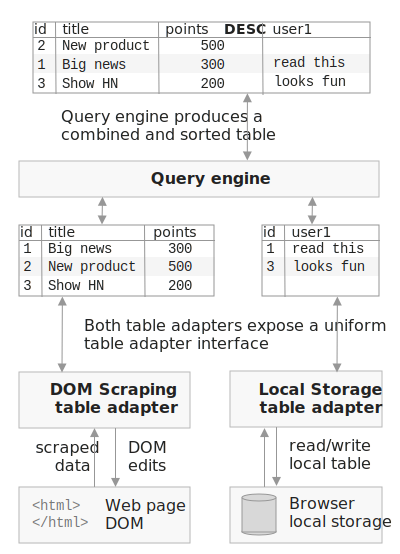
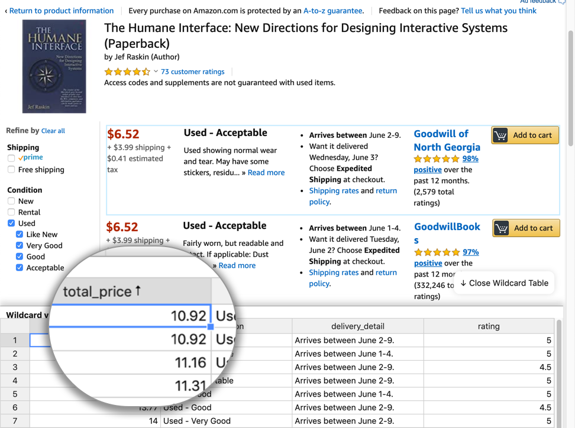
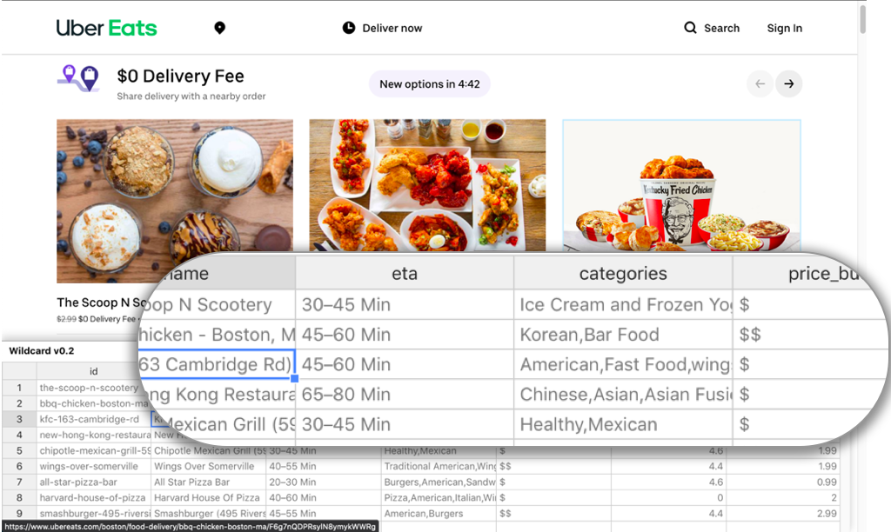

# Introduction

Many applications don't meet the precise needs of their users,
and it is impossible for developers to anticipate everyone's unique requirements.
End user customization systems can help close this gap, by empowering non-programmers
to modify their software to satisfy their personal goals.

Many end user customization systems [@cook2007; @bolin2005; @leshed2008; @chasins2018] offer a scripting model. They use various strategies to make programming more approachable:
friendly syntax, a visual programming environment, or macro recording to bootstrap from concrete demonstrations. But all these techniques build on the same fundamental foundation: an imperative programming model, with statements, mutable variables, and loops.

We have known for decades about an alternative: _direct manipulation_ [@shneiderman1983], where "visibility of the object of interest" replaces "complex command language syntax." Direct manipulation is the _de facto_ standard in GUIs today, but when it comes to customizing those GUIs, it is rarely to be found. Switching from using an application to customizing it via scripting requires an abrupt shift in interaction model, and can pose a steep learning barrier for users not familiar with programming.

We subscribe to MacLean et al.'s vision of a "gentle slope" [@maclean1990] free of such "cliffs," where users should only need to make minimal and incremental investments in skill to achieve their desired customizations. We seek to contribute to this gentle slope with a new method for customizing software via direct manipulation, taking inspiration from visual database query interfaces and spreadsheets, which have successfully enabled millions of end users to compute with data through direct manipulation.

In our proposed paradigm, _data-driven customization_, an application’s UI is augmented with a table view where the user can see and manipulate the application’s internal data. These changes don't just apply to the table; they also result in immediate changes to the application's original user interface. The user can sort/filter data in the UI, inject annotations, pull in related information from other web services, and more, all using the table as a mediating interface. Interacting with the table view resembles interacting with a familiar spreadsheet, but results in customizing an existing application.

<div class="html-only">
{#fig:overview}
</div>
<div class="pdf-only">
```{=latex}
\begin{figure*}
\hypertarget{fig:overview}{%
\centering
\includegraphics[width=\textwidth]{media/overview.eps}
\caption{An overview of data-driven customization}\label{fig:overview}
}
\end{figure*}
```

We have developed a browser extension called Wildcard which uses web scraping techniques to implement data-driven customization for existing Web applications. In [@sec:example], we concretely demonstrate the end user experience of using Wildcard to add features to a news website.

In [@sec:architecture], we explain the system architecture of data-driven customization. We focus on the _table adapter_ abstraction, which allows many different types of underlying data to be bidirectionally mapped to a table. We describe several types of table adapters we’ve built in Wildcard, and also describe future adapters supported by the general paradigm.

We have successfully used Wildcard to build customizations for 11 different websites that serve our own personal needs. In [@sec:reflections], we present reflections from this process. We outline the kinds of customizations we were able to build, limitations we encountered, and some of the challenges of writing scraping logic.

In [@sec:themes], we discuss some key themes from our work:

- _Customization by direct manipulation_: We discuss further how data-driven customization relates to a gentle slope of customization. We suggest that an important point on this slope is the ability to customize an application by directly seeing and changing its data, rather than by writing imperative scripts.
- _Semantic wrappers_: Typically, tools that don't rely on official extension APIs resort to offering low-level APIs for customization. Instead, we propose a community-maintained library of semantic wrappers around existing applications, enabling end users to work with domain data rather than low-level representations.

data-driven customization relates to existing work in many areas. Our goals overlap with many software customization tools, and our methods overlap with direct manipulation interfaces for working with structured data, including visual database query systems and spreadsheets. We explore these connections in [@sec:related-work].

Finally, in [@sec:conclusion], we conclude and describe opportunities for future work.

# Example Scenario {#sec:example}

To concretely illustrate the user experience of data-driven customization, we present a scenario of customizing [Hacker News](https://news.ycombinator.com/), a popular tech news aggregator. [@fig:hacker-news] shows accompanying screenshots.

<div class="html-only">
{#fig:hacker-news}
</div>
<div class="pdf-only">
```{=latex}
\begin{figure*}
\hypertarget{fig:hacker-news}{%
\centering
\includegraphics[width=\textwidth]{media/hacker-news.png}
\caption{Customizing Hacker News by interacting with a table view}\label{fig:hacker-news}
}
\end{figure*}
```
**Opening the table**: When the user opens Hacker News in a browser equipped with the Wildcard extension, they see a table at the bottom of the page. It contains a row for each link on the homepage, listing information like the title, URL, submitter username, number of points, and number of comments ([@fig:hacker-news], Note A). The end user didn't need to do any work to create this table, because a programmer previously created an adapter to extract data from this particular website, and contributed it to a shared library of adapters integrated into Wildcard.

**Sorting by points**: First, the user decides to change the ranking of links on the homepage. Hacker News itself uses a ranking algorithm in which the position of an article depends not only on its point count (a measure of popularity), but also on how long it has been on the site. If the user hasn’t been checking the site frequently, it’s easy to miss a popular article that has fallen lower on the list. Sorting the page just by points would achieve a more stable ranking.

To achieve this ordering, the user simply clicks on the “points” column header in the table. This sorts the table view by points, and the website UI also becomes sorted in the same order ([@fig:hacker-news], Note B). Internally, Wildcard has changed the website's DOM to synchronize it with the sort order of the table. This sort predicate is also persisted in the browser and reapplied automatically the next time the user loads the page, so they can always browse the page sorted by points.

**Adding estimated read times**: Next, the user decides to attempt a more substantial customization: adding estimated read times to each article, in order to prioritize reading deeper content.

The table contains additional empty columns where the user can enter spreadsheet-like formulas to compute derived values. The user enters a formula into the first column, which is named `user1` by default ([@fig:hacker-news], Note C):

```
=ReadTimeInSeconds(link)
```

This formula calls a built-in function `ReadTimeInSeconds` that uses a third-party public web API to compute an estimated read time for the URL's contents. The `link` argument in the formula refers to a column name in the table; the formula is automatically evaluated across all rows in the table, using the value of `link` for each row.

The user clicks the `user1` column header to sort the articles on the page in descending order of estimated read time. They would also like to display the read times in the page, but a number in seconds isn't the most legible format, so they enter another formula in the `user2` column:

```
=Concat(Round(user1/60), "min read")
```

This formula converts seconds to minutes by dividing by 60 and rounding to the nearest integer, and concatenates the result with a string label, producing results like "21 min read".

Finally, the user clicks a menu option in the table header to display the contents of this new column in the original page ([@fig:hacker-news], Note D). Each article on the page now shows an annotation with the estimated read time in minutes. (The formatting of annotations was determined by the programmer who created the adapter for Hacker News.)

**Adding manual annotations**: The user can also manually add notes to the table, by simply entering values into the table without using formulas. In this case, the user jots down a few notes in another column about articles they might want to read, and the notes appear in the page next to the read times ([@fig:hacker-news], Note D). The annotations are also stored in the browser's local storage
so they can be retrieved on future visits.

**Filtering out visited links**: Another way to use formulas to customize Hacker News is to filter out articles the user has already read. (We omit this example from the figure for brevity.) The user can call a built-in function that returns a boolean depending on whether a URL is in the browser's history:

```
=Visited(link)
```

They can then filter the table to only contain rows where this formula column contains `false`;
links that the user has already visited are hidden both from the table view and the original page. This is an example of a customization that the original website could not have implemented,
since websites don't have access to the browser history for privacy reasons.
But by using Wildcard, the user was able to implement the customization locally,
without needing to expose their browser history to Hacker News.

This scenario has shown a few examples of how data-driven customizations
can help a user improve their experience of a website.
[@sec:reflections] explains many other use cases and contexts where the technique applies,
but first we explain how the system works internally.

# System architecture {#sec:architecture}

<div class="html-only">
{#fig:table-adapter}
</div>
<div class="pdf-only">
```{=latex}
\begin{figure}
\hypertarget{fig:table-adapter}{%
\centering
\includegraphics[width=\columnwidth]{media/table-adapter.eps}
\caption{The table adapter architecture}\label{fig:table-adapter}
}
\end{figure}
```
</div>

[@fig:table-adapter] summarizes the overall architecture of
data-driven customization, using a simplified illustration of the Hacker News
example scenario. The name and points value for each article
is scraped from the web page DOM, and user annotations are loaded
from the brower's local storage.

First, the web page and the browser storage are each
wrapped by a **table adapter**, which defines a bidirectional mapping
between an underlying data source and a table.

In addition to a _read mapping_ for how the underlying data should be
represented as a table, it also has a _write mapping_ defining
the effects that edits have on the original data source.
The local storage adapter has a trivial mapping:
it loads a table of data stored in the browser, and persists edits to that state.
The mapping logic of the DOM scraping adapter is much more involved.
It implements web scraping logic to produce a table of data from the web page,
and turns edits into DOM manipulations, such as reordering rows of data on the page.

The two tables are then combined into a single table for the user to view and edit.
The **query engine** is responsible for creating this combined view, and routing the user’s edits back to the individual table adapters. In this example, the query engine has joined the two tables together by a shared ID column, and sorted the result by the points column.

We now examine each component of the system in more detail.

## Table adapters

A key idea in data-driven customization is that a wide variety of data sources can be mapped to a generic table abstraction. In a relational database, the table matches the underlying storage format, but in data-driven customization, the table is merely an _interface layer_. The data shown in the table is a projection of some underlying state, and edits to the table can have complex effects on the underlying state.

Here we describe the abstract interface fulfilled by a table adapter, and then
describe specific types of table adapters we've built so far in the Wildcard system.

### Abstract interface

_Returning a table_: A table adapter exposes a table of data: an ordered list of records. Each record carries a unique identifier and associates named attributes with values. Tables have a typed schema, so the same attributes are shared across all records. We currently support strings, numeric values, booleans, and datetimes as types. The columns also carry some additional metadata, such as whether or not they are read-only or editable.

A table adapter can update the contents of a table at any time in response to changes in the underlying state (e.g., a DOM scraping adapter can update the table when the page body changes). When data changes, the query view is reactively updated in response.

_Handling edits_: The query engine can issue a request to a table adapter to make an edit to a record. The meaning of making an edit can vary depending on the adapter: in the local storage adapter, a new value may be persisted into local storage; in the DOM scraping adapter, an edit may result in changing the value of a form field.

In addition, the query engine also sends additional information about the combined query view
to each table adapter:

_Sorting/filtering_: When the user sorts or filters the query view, an ordered list of
visible IDs is sent to each table adapter. The DOM scraping adapter uses this information
to change the list of rows shown in the web page.

_Data from other tables_: The query engine provides each table adapter with the entire combined table shown to the user. The DOM scraping adapter uses this for injecting annotations—values from other tables are added to the original web page.

_Currently selected record_: As the user clicks around the table view, the query engine broadcasts the record currently selected by the user to each table adapter. The DOM scraping adapter uses this information to highlight the row in the page that corresponds to the selected row in the table, which helps the user understand the mapping between the table and the original UI.

### DOM scraping adapters

DOM scraping adapters are the essential component that enables Wildcard to interface with an existing website UI. In addition to the standard web scraping problem of extracting a table of data from the DOM, a scraping adapter must also manipulate the DOM to reorder rows, edit form entries, and inject annotations as the table is edited.

Because every website has unique content, we rely on programmers to create a DOM scraping adapter for each individual website to make it available for customization in Wildcard. To make this approach viable, we have built a generic DOM scraping adapter which a programmer can configure with the minimal site-specific parts.

_Basic metadata_: The programmer specifies URL patterns that the adapter should activate on, and a set of column names and types to return in the table.

_Specifying scraping logic_: The main component of a site-specific adapter is a single Javascript function that extracts relevant elements from the page using web scraping technqiues. For each scraped row of data, the programmer must return a unique identifier,
and values for each column in the table.

The generic adapter then wraps this scraping function to implement the table adapter interface. For example, when the user sorts the table view, the generic adapter synchronizes the sort order to the DOM by removing the DOM elements corresponding to the rows in the table and reinserting them back into the page in the new order.

_Choosing an ID_: When possible, it is best to choose a server-side identifier
that remains stable across pageloads. This enables user annotations
persisted in local storage to be associated with the same records on
subsequent pageloads. We have found that it's usually possible to find such an
identifier; for example, each item in a page often contains a link to a
page with more details, with a URL that contains a stable ID.

_Types of scraped values_: For each individual value within a row, there are two options for what type
of data can be returned by the programmer-specified scraping function.

The default option is to return a DOM element, in which case the generic adapter
extracts the text contents of the DOM element and casts them to the type of the column.
For example, if the scraping function returns a `<div>` containing
the string "1.23", and the column has a numeric type,
the generic adapter extracts the number 1.23.
The advantage of returning a DOM element is that the value is editable—when the user changes the value in the table, the generic adapter can simply overwrite the inner contents of the DOM element.
In practice, this is most useful for editing the value of form input fields. It's technically possible to edit the contents of any element in the page (e.g. editing the title of a post on Hacker News), but this often isn't particularly useful, so adapter authors have the ability to mark fields as readonly.

Another option is to directly return a value, rather than returning a DOM element.
The advantage of this approach is that the adapter author can perform arbitrary
computations to derive the returned value—for example, they can use a regular expression
to extract a substring. The disadvantage is that the field is no longer writable.
The computation used to derive the value isn't reversible, so there's no way
to reflect a table edit in the DOM.

_Other site-specific customization_: The programmer can optionally override other behavior of the generic DOM scraping adapter,
including logic for when to re-run the scraping function in response to page changes,
how to style injected annotations, and how to style the currently selected row in the table.
We've chosen sensible defaults that generally result in a workable adapter without needing to change
these options, but they can improve the experience on a specific website. For example,
by default we highlight the currently selected row with a blue border, but
on some sites this is hard to see or breaks the layout, so setting a background color works better.

### AJAX scraping adapters

An AJAX scraping adapter intercepts AJAX requests made by a web page, and extracts information from those requests to add to the table. When available, this tends to be a helpful technique because the data is already in a structured form so it is easier to scrape, and it often includes valuable information not shown in the UI.

As with DOM scraping adapters, we have made it easy for programmers to create site-specific AJAX scraping adapters. A programmer writes a function that specifies how to extract data from an AJAX request, and the framework handles the details of intercepting requests and calling the programmer-defined function.^[So far we have only implemented AJAX scraping in the Firefox version of Wildcard, since Firefox has convenient APIs for intercepting requests. It appears possible to implement in Chrome and Edge as well, but we have not finished our implementation.]

In order to join the tables produced by AJAX scraping and DOM scraping,
a common set of identifiers is required across records in the two tables.
Often there is a server-defined ID present both in the DOM and in AJAX responses;
if not, the programmer can use some set of overlapping data (e.g. an item name)
as a shared ID.

### Local storage adapters

The local storage adapter simply stores a table of data in the browser.
This is currently only used to persist annotations.

The table view is initialized with empty columns such as `user1` which serve as
the user's "scratch space," as shown in [@sec:example]. When the user
makes edits to these columns, new rows are created in the local storage table.
The rows contain the record ID from the DOM scraping adapter,
which enables them to be re-associated with the same records on subsequent pageloads.

### Future Adapters

We have designed the table adapter API to be general enough to support other types of useful adapters in the future. Here are two examples:

**Integrated website adapters**: A key benefit of the table adapter abstraction is that Wildcard is not coupled to web scraping as the only means for integrating with existing sites, but can also accommodate first party developers adding support directly into their own websites. An "integrated website adapter" installed by the developer could directly access the internal state of the application, providing the same functionality as a DOM scraping adapter but in a more robust way.

With the advent of rich frontend web frameworks, structured application state is now often available in the web client. We suspect it is possible to create plugins for frontend frameworks that expose this state to Wildcard with only minimal effort from the application developers. To test this hypothesis, we created an early proof-of-concept of an integrated website adapter for the popular [Redux](https://redux.js.org/) Javascript state management library. In Redux, app developers conveniently already represent the state of a user interface as a single object, so to expose a table of data to Wildcard, the developer simply writes a function that maps the centralized state object to a table.

Customizability is sometimes a key selling point for software. An integrated website adapter would provide a way for developers to integrate with an ecosystem of formulas and customization tools without needing to build all that functionality from scratch.

**Shared storage adapter**: It would be useful to share user annotations among users and across devices—for example, collaboratively taking notes with friends on options for places to stay together on a trip. The existing local storage adapter could be extended to share live synchronized data with other users. This could be achieved through a centralized web server, or through P2P connections that might provide stronger privacy guarantees.

## Query engine

The query engine is responsible for coordinating across multiple table adapters. It joins data across multiple tables and creates a single result table which is shown to the user through the editor. It also handles all user interactions and routes appropriate messages to each table adapter.

Queries are processed in three steps. First, the query invokes a primary DOM scraping adapter that associates table rows with elements in the application’s user interface. Next, additional tables (AJAX data, local storage data) are left-joined by ID. Finally, the result table is sorted and filtered according to user-specified predicates.

One way to view this query model is as a tiny subset of the SQL query model. Despite its simplicity, this model has proven sufficient for meeting our customization needs, and minimizes the complexity of supporting arbitrary queries. But because it fits into the general paradigm of relational queries, it could theoretically be extended to support a wider range of queries.

The query engine is also responsible for executing formulas. We have built a small formula language resembling a spreadsheet formula language. As in visual database query tools like SIEUFERD [@bakke2016] and [Airtable](https://airtable.com/), formulas automatically apply across an entire column of data, and reference other column names instead of values in specific rows. This is more convenient than needing to copy-paste a formula across an entire column as in spreadsheets, and has worked for all of the customizations we have built.

## Table editor

We provide a table editor view as the user interface on top of the query engine. Our table editor is built with the Handsontable Javascript library, which provides built-in UI elements for viewing, editing, sorting, and filtering a table.

In addition to the basic table editing operations, we also provide _cell editors_: UI widgets that expose a custom editing UI for a single cell of the table view. A programmer building a cell editor need only integrate it with the table viewer; propagating values into the website UI is handled by the site-specific DOM adapter. In [@sec:reflections] we provide some examples of using cell editors.

The table editor only serves as a shallow interface layer over the query engine,
relaying user commands to the query engine and rendering the resulting data table.
Because of this architectural split, it would be straightforward to develop
additional table editor interfaces on top of the Wildcard system. For example,
we could provide a calendar view for displaying a table containing a date column.

# Reflections on Usage {#sec:reflections}

<div class="pdf-only">
```{=latex}
\begin{table*}[]
\begin{tabular}{llrl}
\hline
\textbf{Website} & \textbf{Description} & \textbf{LOC} & \textbf{Example customizations}                                                              \\ \hline
Airbnb           & Travel               & 73                                       & Add Walkability Scores to listings. Sort listings by price.                           \\
Amazon           & Online shopping      & 99                                       & Sort third party sellers by total price, including fees.                                \\
Blogger          & Blogging             & 36                                       & Use alternate text editor to edit blog posts.                                                 \\
Expedia          & Travel               & 41                                       & Use alternate datepicker to enter travel dates.                                               \\
Flux             & Data portal          & 67                                       & Use Wildcard as a faster table editor for editing lab results.                                \\
Github           & Code repository      & 62                                       & Sort a user's code repositories by stars to find popular work.                                \\
Hacker News      & News                 & 69                                       & Add read times to links. Filter out links that have been read. \\
Instacart        & Grocery delivery     & 48                                       & Sort groceries by price and category. Take notes on items.                                   \\
Uber Eats        & Food delivery        & 117                                      & Sort/filter restaurants by estimated delivery ETA and price.                                 \\
Weather.com  & Weather              & 51                                       & Sort/filter hourly weather to find nice times of day.                                        \\
Youtube          & Videos               & 80                                       & Sort/filter videos by length, to find short videos to watch.                                 \\ \hline
\end{tabular}
\caption{A list of data-driven customizations that we have implemented using Wildcard.}
\label{tab:websites}
\end{table*}
```
</div>

<div class="html-only">
  todo: fill in this table
</div>

To evaluate data-driven customization in practice, we built the Wildcard
browser extension, which implements data-driven customization in the context of
existing websites. It is implemented in Typescript, and works across
three major browsers: Chrome, Firefox, and Edge.

We developed site-specific adapters for 11 websites that we personally use frequently, and then built customizations for those websites using the Wildcard table view. Table 1 summarizes these results, showing the number of lines of code in the adapter for each site, and some example customizations we created. Here we offer our reflections from these experiences using the system, focused on two key questions:

- How broad is the range of possible customizations in this paradigm?
- How feasible is it to build DOM scraping adapters for real websites?

## Range of customizations

We have found that data-driven customization can serve a broad range of useful purposes.
Here we expand on some archetypal examples that illuminate aspects of
using the system in practice.

### Sorting/filtering

It might seem that most websites already have adequate sorting and filtering functionality, but we have found it surprisingly helpful to add new sorting/filtering functionality to websites using Wildcard.

Sometimes, websites have opaque ranking algorithms which presumably maximize profit but restrict user agency. For example, Airbnb previously allowed users to sort listings by price, but removed that feature in 2012. In other cases, a lack of sorting options seems more like an innocent omission; for example, the Instacart grocery delivery service has a spartan UI for viewing an order, which doesn't allow for sorting items by price or category. In both of these cases, Wildcard enables users to take back some control.

In the current implementation of Wildcard, users can only sort and filter entries that are shown on the current page, which means that users are not entirely liberated from the site's original ranking. This restriction could be overcome in the future by scraping content across multiple pages, or by using an integrated adapter and avoiding scraping altogether. However, we’ve also realized that sorting/filtering a single page of a paginated list is sometimes an acceptable outcome (and even a preferable one). It’s more useful, for example, to sort 30 recommended Youtube videos than to try to sort all videos on Youtube.

<div class="html-only">
{#fig:amazon}
</div>
<div class="pdf-only">
```{=latex}
\begin{figure}
\hypertarget{fig:amazon}{%
\centering
\includegraphics[width=\columnwidth]{media/amazon.png}
\caption{Sorting the used sellers page on Amazon by total price, including fees. The original page doesn't have sorting, and doesn't show the combined price.}\label{fig:amazon}
}
\end{figure}
```

<div class="html-only">
{#fig:ubereats}
</div>
<div class="pdf-only">
```{=latex}
\begin{figure}
\hypertarget{fig:ubereats}{%
\centering
\includegraphics[width=\columnwidth]{media/ubereats.png}
\caption{Organizing takeout restaurants on Uber Eats by delivery ETA and price}\label{fig:ubereats}
}
\end{figure}
```

### Annotating

Many web annotation systems focus on annotating text or arbitrary webpage content, but Wildcard limits annotations to structured objects extracted by an adapter, resulting in a different set of use cases. Annotating with Wildcard has proven most useful when taking notes on a list of possible options (e.g., evaluating possible Airbnb locations to rent). We have also used it with Instacart’s online grocery cart, for jotting down notes as we review an order and consider modifications (shown in [@fig:instacart]).

### Formulas

Formulas are the most powerful part of the Wildcard system. So far, our language supports only a small number of predefined functions. Adding more should allow a broad range of useful computations, as shown by the success of spreadsheets.

Formulas are especially useful for fetching data from Web APIs. We’ve used them to augment Airbnb listings with walkability scores, and to augment Hacker News articles with estimated read times as shown in [@sec:example]. One challenge of the current language design is that supporting a new web API requires writing Javascript code to add a new function to the language, because web APIs typically return complex JSON data structures that can’t be easily displayed in a single table cell. In the future we would like to make it possible to call new APIs without adding a dedicated function, which might require adding functions to the formula language that can manipulate JSON data.

We have also found instances where simple data manipulation is useful,
e.g. transforming the results of an API call with basic
arithmetic and string operations, as shown in [@sec:example].

<div class="html-only">
{#fig:instacart}
</div>
<div class="pdf-only">
```{=latex}
\begin{figure}
\hypertarget{fig:instacart}{%
\centering
\includegraphics[width=\columnwidth]{media/instacart.png}
\caption{Taking notes on Instacart grocery items, after sorting them by price}\label{fig:instacart}
}
\end{figure}
```

### Cell editors

We developed two cell editors, to explore the benefits of adding custom UI
for editing values in the table.

One valuable feature is that users can incorporate their private information into a web UI. We created a datepicker based on the [FullCalendar](https://fullcalendar.io/) plugin, which can load data from a Google Calendar. This makes it convenient to enter dates into a website based on the user’s personal calendar information, without uploading that information to the website itself.

Another benefit is that a user can choose a preferred widget for editing information across different sites that typically provide a fragmented editing experience. We built a text editor based on the [CKEditor](https://ckeditor.com/) rich text editor, and integrated it with Google’s Blogger website by representing the contents of a blog post as a single table cell containing an HTML string (shown in [@fig:blogger]). If there were site adapters available for other websites with rich text entry, the user could then use a single rich text editor to edit text across the whole web.

<div class="html-only">
{#fig:blogger}
</div>
<div class="pdf-only">
```{=latex}
\begin{figure}
\hypertarget{fig:blogger}{%
\centering
\includegraphics[width=\columnwidth]{media/blogger.png}
\caption{Using a custom text editor widget to edit a blog post on Blogger. The text is synchronized with the Blogger editor through a table cell.}\label{fig:blogger}
}
\end{figure}
```

### Limitations

There are many customizations that are not possible to implement with data-driven customization. Some of the limitations are specific to the current implementation of the Wildcard extension, but others are more fundamental to the general paradigm.

One limitation is that Wildcard can only make customizations that use the available data exposed in the table. If the adapter doesn't expose some piece of data, the user can't use it in their customization. The table data format also rules out customizing certain sites that don't have a way to map to a table. The UI modifications available in Wildcard are also limited in scope; deleting arbitrary buttons isn’t possible, for example. There is no facility for running automations when the user isn't actively viewing a page—at one point, we wanted to build an automation to repeatedly load a grocery delivery website to check for open delivery slots, but it didn't seem possible to achieve this in Wildcard.

We consider these limitations to be an acceptable outcome. Our goal is to support as many useful customizations as possible with a low threshold of difficulty, and not to span all possible customizations. If users want to implement more sophisticated customizations, they have the option of graduating to more advanced customization tools like scripting languages.

We have found that one benefit of showing structured data is predictability: once we build an adapter for a website, it is clear what data is available or unavailable for use in customizations. Also, there is sometimes a way to reframe an imperative script in terms of our direct manipulation model. For example, a script that iterates through rows in a page adding some additional information to each row can be reproduced using a single formula in Wildcard.

## Viability of scraping

Our second evaluation area relates less to the conceptual approach of
data-driven customization, and more to the specific implementation
of customizing existing web applications.
In order for third-party customization through Wildcard to succeed,
it is important that creating usable adapters for existing websites takes minimal effort.

Nearly all of our DOM scraping adapters were created by members of our team. However, an external developer unaffiliated with the project contributed one adapter, designed to sort the Github page listing a user's repositories, and they described the experience as "very straightforward."

The adapters for our test sites ranged from 36 to 117 lines of code, averaging 68 lines; Table 1 shows the number of lines of code for each adapter. Most of the code in the adapters
is simply using DOM APIs and CSS selectors to implement conventional web scraping logic.

Some of the challenges of writing a DOM scraping adapter are the same ones as with writing normal web scraping code. Sometimes, addressing the desired set of elements can be difficult, and when sites change, scrapers can break—we observed several instances where sites changed their
CSS classes and caused Wildcard adapters to no longer work. One benefit of a library of
shared wrappers is that if many customizations depend on some piece of scraping logic,
rather than having the scraping logic embedded in a single browser extension,
it should be more likely to be fixed quickly.

The interactive nature of Wildcard also introduces additional challenges beyond normal web scraping. One challenge is registering appropriate event handlers to update the table data in response to UI changes that happen after initial page load. Another challenge is persisting updates to the DOM—some websites use virtual DOM frameworks that can occasionally overwrite changes made by Wildcard. So far, in practice we've managed to work around these issues for all of the websites we've tried, but we don't claim that any website can be customized through DOM scraping. As web frontend code gets increasingly complex (and starts to move beyond the DOM to other technologies like Shadow DOM or even WebGL), it may become increasingly difficult to customize websites from the outside without first-party support.

AJAX scraping proved very useful in several cases. The Uber Eats website was
challenging to scrape because it has a complex DOM structure with machine-generated
CSS classes, but the site also uses AJAX requests which contain all the
relevant data in a structured form that is much easier to extract.
We also found examples where relevant information wasn't present in the DOM at all.
On the grocery delivery site Instacart, we found that AJAX requests contained
additional data not shown in the UI, enabling us to do things like
sort grocery items by category.

# Key themes {#sec:themes}

Here we discuss some themes that we've explored with this work,
which go beyond our specific approach and address broader issues in software
customization.

## Customization by direct manipulation {#sec:dm}

Hutchins, Hollan and Norman [@hutchins1985] define a direct manipulation interface as one that uses a model-world metaphor rather than a conversation metaphor. Instead of presenting an “assumed” but not directly visible world that the user converses with, “the world is explicitly represented” and the user can “[act] upon the objects of the task domain themselves.”

Although most GUIs today employ direct manipulation, software customization tools typically use an imperative programming model, which implements the conversational metaphor rather than direct manipulation. Here, for example, is how a user retrieves a list of of calendar names from the Calendar application in Applescript [@cook2007], the scripting language for customizing Mac OS applications:

```
tell application "Calendar"
  name of calendars
end tell
```

Some customization environments like Mac Automator and Zapier forego textual syntax and let the user connect programs and construct automations by dragging and dropping icons representing commands. These environments still do not constitute direct manipulation, though: the objects being manipulated are in the domain of programming, not in the domain of the task at hand.

Imperative programming is a reasonable choice as the model for building customizations. Turing-complete programming provides a high ceiling for possible customizations, and a sequence of commands is a natural fit for automations that simulate a series of steps taken by the user. There is, however, a serious drawback to this approach. MacLean et al. [@maclean1990] describe an ideal for user-tailorable systems: a “gentle slope” from using to customizing, where small incremental increases in skill lead to corresponding increments of customization power. Requiring users wanting to customize their applications to learn programming creates an abrupt “cliff,” exacting a significant investment in learning even to implement the simplest customizations. Another goal of MacLean et al. is to make it “as easy to change the environment as it is to use it”—at least for some subset of changes. But in scripting languages, the experience of customization does not remotely resemble the experience of use.

With data-driven customization we aim to provide a gentler slope, by using direct manipulation for software customization. The data shown in the table view is the domain data from the original application. The user makes changes to the data by selecting areas of interest in the table, e.g. sorting/filtering by clicking the relevant column header, or adding annotations by clicking and typing on the relevant row. At every step, the user receives intermediate feedback, not only in the table view, but also in the original application, so it's clear whether they are making progress towards their desired result. These types of interactions are common in GUI applications, and Wildcard therefore seems to meet MacLean et al.’s goal: some one-click customizations are as easy as using the original application. Formulas introduce some additional complexity, but spreadsheets have demonstrated that formula programming is still accessible to many users, helped by the pure functional semantics and the visibility of intermediate results.

One aspect of directness that we have chosen not to pursue in Wildcard is enabling customization in closer proximity to the original user interface elements, as explored by tools like Scotty [@eagan2011]—all customization occurs in a separate panel next to the original UI.
While closer proximity might be helpful, we have found that augmenting the original UI with a distinct, additional representation provides a more consistent experience across all applications, and clearly shows what structured data is available to work with. We also emphasize the mapping between the representations by highlighting content in the original page, similiar to the way that browser developer tools highlight the currently selected element in the DOM inspector in the original page.

Ainsworth et al. provide a helpful taxonomy of the value of multiple representations [@ainsworth1999]. In their terms, Wildcard plays a _complementary role_ by supporting a _different set of tasks_ from the original application, while displaying _shared information_. Wildcard may also help construct _deeper understanding by subtraction_—by stripping away details and only showing the essential data in an interface, Wildcard encourages thinking of an application in terms of its core information,
rather than the specific capabilities provided by the current user interface. In our anecdotal experience, we've often found that looking at a site's data in table format tends to spur new ideas for
customizations which weren't evident from looking at the original UI.

As noted in [@sec:reflections], there are many customizations that can be achieved in scripting languages that cannot be implemented in Wildcard. We consider this an acceptable tradeoff in exchange for a gentler slope in customization, and we show in [@sec:example] and [@sec:reflections] that our model can implement many useful customizations.

## Semantic wrappers

_Ad hoc customization tools_ enable customization without using official extension APIs, enabling a broader range of customizations on top of more applications. For example, web browser extensions have demonstrated the utility of customizing websites through manipulating the DOM, without websites needing to provide explicit extension APIs. However, ad hoc customization comes with a cost: these tools typically operate at a low level of abstraction, e.g. manipulating user interface elements, rather than in a meaningful domain model. This makes it harder for end users to write scripts, and makes the resulting scripts more brittle as the specifics of a user interface change.

_Anticipated customization tools_, in contrast, use explicit extension APIs provided by the application developer. Examples of this include accessing a backend web API, or writing a customization in Applescript for an application that exposes its domain model to the scripting language. The main benefit of this style is that it allows the extension author to work with meaningful concepts in the application domain—“create a new calendar event” rather than “click the button that contains the text 'new event'.”—which makes customizations easier to build and more robust. However, the plugin API limits the types of customizations that can be built, and many applications don't have any plugin API.

With Wildcard, we use a hybrid approach that aims to provide the best of both worlds. Third-party programmers implement site-specific adapters that are internally implemented as ad hoc customizations, but externally provide a high-level interface to the application, abstracting away the details of the user interface. These wrappers are added to a shared repository, available to all users of the system. When an end user is using a site that already has an adapter, they benefit from a semantic customization experience that avoids low-level details.

One way to view this approach is as introducing a new abstraction barrier into third-party extension. Typically, a third party customization script combines two responsibilities: 1) mapping the low-level details of a user interface to semantic constructs (e.g., using CSS selectors to find certain page elements), and 2) handling the actual logic of the specific customization. Even though the mapping logic is often more generic than the specific customization, the intertwining of these two responsibilities in a single script makes it very difficult to share the mapping logic across scripts.

With Wildcard we propose a decoupling of these two layers: a repository of shared wrappers maintained by programmers, and a separate repository of specific customizations built on top of these wrappers. This general architecture has been successfully demonstrated by projects like [Gmail.js](https://github.com/KartikTalwar/gmail.js/), an open source project that wraps the Gmail web client in a convenient API for browser extensions to build on.

The success of semantic wrappers depends on a key hypothesis: that
a single wrapper created by a programmer can be used for many different
purposes by end users. Although we've validated that a single generic adapter
can support many customizations, so far the people making the adapters
have largely been the same people building customizations on top of them,
so more work is needed to fully test this hypothesis.

A helpful future addition would be to allow end users to create wrappers themselves, so that more people could contribute to the shared library. There are many existing projects exploring end-user web scraping (such as Helena [@chasins2018]) which might prove helpful; however, because the needs of a Wildcard adapter are slightly more complex than a traditional web scraper (as discussed in [@sec:architecture]), further work might be needed to enable end-user wrapper creation.

The distribution mechanism for semantic wrappers is also important for encouraging an ecosystem of shared wrappers. Currently, the distribution mechanism is simply merging the code for all adapters into the main Wildcard codebase. This is the simplest workable solution, but has its downsides: contributing involves a
fairly high barrier of creating a pull request on Github, and using newly contributed wrappers
requires installing a new version of the extension. In the future we might explore
other mechanisms, like an online repository that the extension
pulls from dynamically. Security is also a consideration—DOM scraping
adapters can execute arbitrary Javascript code, which opens up the possibility
of malicious adapters being contributed. Currently we plan to solve this challenge
with centralized code review, but another approach we are considering is
using or inventing a more restricted domain-specific language for specifying scraping logic.

# Related Work {#sec:related-work}

This paper extends work reported in a workshop paper by Litt and Jackson [@litt2020] which presented an early version of the Wildcard extension. We have substantially extended their work in this paper by creating the table adapter abstraction, reimplementing the internals of Wildcard around that abstraction, evaluating the system on many more websites and use cases, and by characterizing the design of the system in much more detail than in their workshop paper.

data-driven customization relates to two broad areas of related work. Our problem statement is related to software customization tools, and our solution approach is related to spreadsheets and other direct manipulation interfaces.

## Customization tools

data-driven customization is most closely related to other tools that aim
to empower end users to customize software without traditional coding.

This lineage goes back at least to the Buttons system by MacLean et al. [@maclean1990], where
Xerox Lisp users could share buttons that performed various "tailoring" actions
on the system. The authors proposed the "gentle slope" idea which has
greatly influenced our approach to data-driven customization (as discussed in [@sec:dm]).
The authors also point out the importance of a "tailoring culture"
where people with different skillsets collaborate to produce useful customizations;
in their system, Lisp programmers create buttons that others can use, modify,
and rearrange. This division of labor corresponds to our idea of semantic wrappers,
where end user customization is supported by programmer-created building blocks.

More recently, web customization tools have aimed to enable end users
to modify web interfaces without programming. Sifter [@huynh2006] enables end users to sort and filter lists of data obtained by web scraping, much like Wildcard’s sorting features. The main difference between the systems is that data-driven customization has many other use cases besides sorting and filtering. Also, Sifter involves end users in a semi-automated data extraction process, rather than having programmers create wrappers. This provides coverage of more websites, but at the expense of complicating the end user experience. We could integrate end user scraping techniques in Wildcard in the future, but we believe that when possible it’s valuable for end users to have a customization experience decoupled from the challenge of web scraping the underlying data. Sifter also implements scraping across multiple pages, a valuable feature for sorting and filtering that isn’t present in Wildcard.

Thresher [@hogue2005] helps end users create wrappers that map website content to Semantic Web schemas like "Movie" or "Director," and augments websites with new functionality by exploiting that schema information. Wildcard shares the general idea of wrappers, but maps to a generic table data type rather than more specific schemas, increasing the range of supported data and allowing for a simpler mapping process.

There are many software customization tools that offer simplified forms of programming for end users. Chickenfoot [@bolin2005] and Coscripter [@leshed2008] offer user friendly syntax for writing web automation scripts; Applescript [@cook2007] has a similar goal for desktop customization. There are visual programming environments for customization that don’t involve writing any text: [Automator](https://support.apple.com/guide/automator/welcome/mac) for Mac and [Shortcuts](https://apps.apple.com/us/app/shortcuts/id915249334) for iOS are modern options for customizing Apple products, and [Zapier](https://zapier.com/) enables users to
connect different web applications together visually. As mentioned previously, these tools all require writing imperative programs, in contrast to the more declarative and direct approach of data-driven customization.

## Spreadsheets and visual query interfaces

Another relevant area involves spreadsheets and visual query interfaces. We take inspiration from these tools in our work, but apply them in a different domain: customizing existing software applications, rather than interacting with databases or constructing software from scratch.

The most closely related work is in systems that offer spreadsheet-like
querying of relational data. SIEUFERD by Bakke and Karger [@bakke2016] is
one such recent system, and their paper presents a survey of many other similar tools.
Our work is particularly influenced by the authors’ observation that a user should be able to modify queries by interacting with the results of the query rather than some representation of the query itself. SIEUFERD’s interface supports a far more general range of queries than Wildcard, but the core principles of the user interface are the same. [Airtable](https://airtable.com/) is another example of a modern commercial product that offers spreadsheet-like interaction with a relational database.

Our work is also inspired by the many projects that have explored using
spreadsheets as a foundation for building software applications, including
Object Spreadsheets [@mccutchen2016], Quilt [@benson2014], Gneiss [@chang2014],
Marmite [@wong2007], and [Glide](https://www.glideapps.com/). We share the main
idea of connecting a spreadsheet view to a GUI, but we
apply it to software customization, rather than building software from scratch.

Another related system is ScrAPIr, by Alrashed et al. [@alrashed2020], which enables end users to access backend web APIs without programming. ScrAPIr shares our high level goal of end user empowerment, as well as the idea of wrappers, by creating a shared library of wrappers around existing web APIs. Unlike Wildcard, however, ScrAPIr targets explicit APIs exposed by developers. It also focuses on backend services and doesn’t aim to extend the frontend interfaces of web applications.

# Conclusion and Future Work {#sec:conclusion}

In this paper, we have presented data-driven customization, a new paradigm for
customizing software by direct manipulation of the underlying structured data.
We have demonstrated the paradigm using the Wildcard browser extension,
and have used it to create useful customizations for a variety of websites.

So far, most usage of Wildcard has come from members of the project team.
Our primary goal for future work is to evaluate the system with a
broader group of users. What usability barriers do end users face when using the system?
What types of customizations do they choose to create? What formulas prove most helpful?
Through real deployment of the tool, we hope to validate the viability
of a community-maintained library of site-specific adapters.

Another area for future work is exploring whether it's possible to express a broader range of customizations by extending the table-editing paradigm. Are there ways to offer an increase in power and functional complexity, while retaining a programming model that is simpler for end users than conventional coding? For example, one possibility would be to enable users
to set up triggers to perform actions like sending notifications when certain conditions are met in the table view.

As computing plays an ever greater role in our lives, it is increasingly important that end users have agency over the behavior of their software, rather than having every detail be dictated by companies whose incentives are not always aligned with the user’s interests. We hope that data-driven customization can serve as a point on the path from normal use to deep modification, in support of a more adaptable experience for all computer users.
